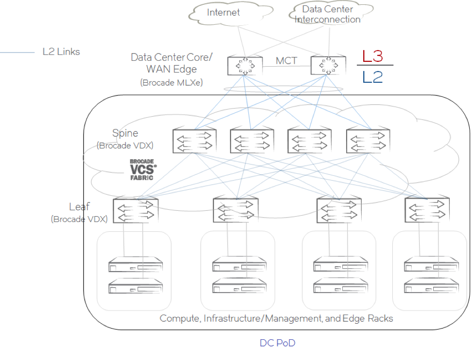
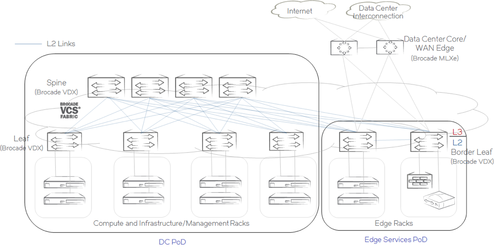
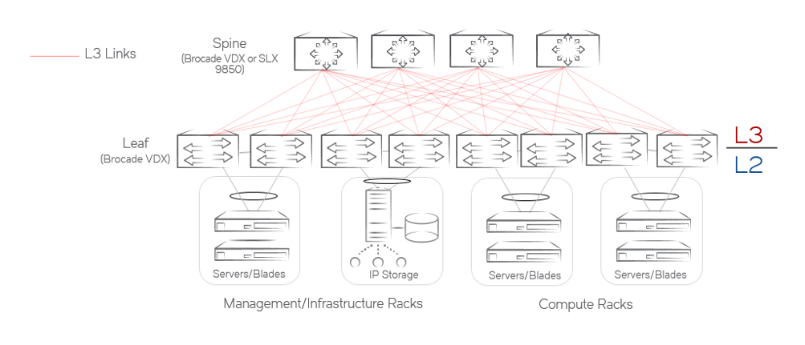
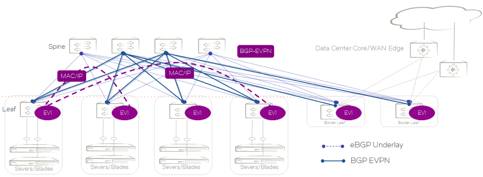

DC Fabric Automation Suite
==========================

Extreme Networks Data Center products enable customers to build cloud optimized network and network
virtualization architectures using VDX and SLX products. Extreme supports multiple network
architectures for data center fabric depending on the customer application and scale requirements.
Two main fabric architectures are “VCS Fabric” and “IP Fabric”. VCS Fabric is a TRILL-based
Layer-2 fabric, while IP Fabric is a BGP-based Layer-3 fabric, which can be used with or without
BGP-EVPN. The section below describes the most common topologies for these two fabric architectures.

The DC Fabric Automation Suite can be used to manage both fabric architectures. Workflows include
initial fabric configuration, tenant provisioning, edge port configuration, etc. Some workflows
are specific to the fabric architecture and the topology, while others work for all architectures.

VCS Fabric
----------

VCS Fabric Technology can be used to deploy a data center fabric in different topologies.
This section summarizes the most common deployment models for VCS Fabric. For more details
on the design considerations for each of the deployment models, refer to the `Data Center
Architecture Solution Design Guide
<http://www.brocade.com/content/html/en/solution-design-guide/brocade-dc-fabric-architectures-sdg/index.html>`_

The diagram below shows a data center site built using a leaf-spine topology deployed using
VCS Fabric technology. In this topology, the spines are connected to the data center core/WAN edge
devices directly. The spine PIN in this topology is sometimes referred to as the "border spine"
because it performs both the spine function of east-west traffic switches and the border function
of providing an interface to the data center core/WAN edge.

.. figure:: ../../_static/images/solutions/dcfabric/vcs_fabric_l3_spine.png
      :align: center

      **VCS Fabric with Layer 3 Boundary at the Spine**

The Layer 3 boundary for all networking endpoints is shown to be in the spine. The spine devices
participate in active-active gateway redundancy using VRRP-E or Fabric Virtual Gateway. 

Alternatively, in the diagram below, the Layer 3 boundary for all networking endpoints is shown
to be at the WAN edge/data center core. A port channel connects the spines to the data center
core/WAN edge devices. Multitenancy can be achieved at Layer 3 using Virtual Routing and Forwarding
(VRF) instances at the Layer 3 boundary:

      **VCS Fabric with Layer 3 Boundary Outside the Fabric**

The Layer 3 boundary for all networking endpoints can also be at the border leaf switches, as shown
below. Here the border leafs are shown as part of the VCS fabric. However, they can be a separate VCS
fabric as well, in which case, the connections between the spine and the border leaf use a Layer 2
dual-side vLAG:

      **VCS Fabric with Layer 3 Boundary at the Border Leaf**

Workflows for VCS fabric include:

* add_multihomed_endpoint
* add_singlehomed_endpoint
* configure_vrrpe_gw
* add_multihomed_endpoint_and_gw

See the :doc:`operation/overview` documentation for details about these workflows.

IP Fabric
---------

IP Fabric provides a Layer 3 Clos deployment architecture for data center sites. With
IP Fabric, all links in the Clos topology are Layer 3 links. A data center PoD built with IP fabrics
supports dual-homing of network endpoints using multiswitch port channel interfaces formed between a
pair of VDX switches participating in a vLAG. This pair of leaf switches is called a vLAG
pair. For more details on the design considerations for IP fabric, refer to the
`Data Center Architecture Solution Design Guide 
<http://www.brocade.com/content/html/en/solution-design-guide/brocade-dc-fabric-architectures-sdg/index.html>`_

      **An IP Fabric Data Center PoD Built with Leaf-Spine Topology and a vLAG Pair for Dual-Homed Network Endpoint**

The Layer 3 boundary in an IP fabric is always at the leaves. In cases of multi-homed network
endpoints, gateway redundancy using VRRP-E is used to provide active-active forwarding on the vLAG pair.

IP Fabrics can also be deployed with BGP-EVPN. With BGP-EVPN network virtualization,
network virtualization is achieved through creation of a VXLAN-based overlay network. BGP-EVPN
network virtualization leverages BGP-EVPN to provide a control plane for the virtual overlay network.
BGP-EVPN enables control-plane learning for end hosts behind remote VXLAN tunnel endpoints (VTEPs).
This learning includes reachability for Layer 2 MAC addresses and Layer 3 host routes.

With BGP-EVPN deployed in a data center site, the leaf switches participate in the BGP-EVPN control- and
data-plane operations. These are shown as BGP-EVPN Instance (EVI) below. The spine switches
participate only in the BGP-EVPN control plane. For more details on the design considerations for
IP fabric, refer to the `Data Center Architectures for Network Virtualization Solution Design Guide
<http://www.brocade.com/content/html/en/solution-design-guide/brocade-dc-network-virtualization-sdg/index.html>`_
and `Network Virtualization in IP Fabric with BGP EVPN Validated Design
<http://www.brocade.com/content/html/en/brocade-validated-design/brocade-ip-fabric-bvd/GUID-35138986-3BBA-4BD0-94B4-AFABB2E01D77-homepage.html>`_

      **A BGP EVPN based IP Fabric Data Center PoD Built with Leaf-Spine Topology**

Workflows for IP Fabric architecture include:

* add_multihomed_endpoint
* add_singlehomed_endpoint
* configure_vrrpe_gw
* add_multihomed_endpoint_and_gw
* create_l2_tenant_evpn
* create_l3_tenant_evpn
* add_multihomed_endpoint_and_gw_evpn

See the :doc:`operation/overview` documentation for details about these workflows.

Supported Devices
-----------------

The DC Fabric Automation Suite supports the following devices:

**DC Fabric Automation Suite v1.2**

* SLX 9140, 9240 running SLX OS 17s.1.02
* All VDX devices running NOS 7.1.0a, 7.2.0a

**DC Fabric Automation Suite v1.1**

* IP Fabric (no EVPN) - SLX 9850 running SLX-OS SLX-OS_16r.1.1, SLX-OS_17r.1.00 and later
* IP Fabric (no EVPN) - SLX 9540 running OS SLX-OS_17r.1.00 and later
* VCS Fabric - VDX 6740, 6940, 8770 running Network OS 6.0.2c 
* IP Fabric & EVPN - VDX 6740, 6940, 8770 running Network OS 7.0.1b and 7.1 

What's Next?
-------------------------------
* Install and run |ewc| and DC Fabric Automation Suite - follow the :doc:`install` guide.
