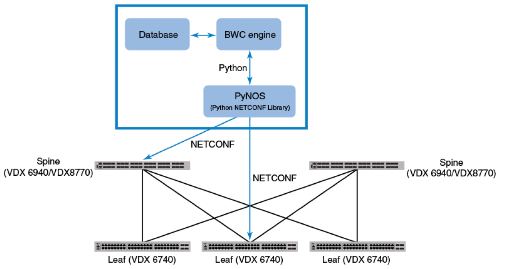

Operation Overview
==================

Introduction
------------

This document provides an overview of how to use the |ipf| to automate provisioning and 
maintenance of a Brocade IP Fabric. The |ipf| can automatically configure interfaces, BGP 
peerings and related settings. This ensures consistent configuration across the fabric, 
with minimal effort.

.. note::
    This document covers the operation of the |bwc| |ipf|. For more information
    about Brocade IP Fabrics in general, see the `Brocade Network OS IP Fabric
    Configuration Guide <http://www.brocade.com/content/html/en/configuration-guide/nos-701-ipfabrics/index.html>`_
    and the `Brocade IP Fabric Validated Design <http://www.brocade.com/content/html/en/brocade-validated-design/brocade-ip-fabric-bvd/GUID-35138986-3BBA-4BD0-94B4-AFABB2E01D77-homepage.html>`_ 

The |ipf| supports easy integration with Zero-Touch Provisioning (ZTP). It can also be used 
without ZTP, but initial switch setup and registration will be a manual process.

The default configuration has a set of pre-defined parameters used to create the fabric, such 
as ASN range, IP address ranges, etc. To see these parameters, and change them, refer to the
:ref:`IP Fabric parameters<ip_fabric_parameters>` documentation.

    **Components of Brocade Flow Composer**

.. note::
    The VCS ID for spine and leaves should be different in both the ZTP-enabled
    configuration and non-ZTP enabled configuration. If the VCS IDs are same, the switch will
    automatically form an Ethernet fabric. For example, VCS ID for spines can be 1 and VCS ID for
    leaves can be 2.

Configuring an IP Fabric with ZTP enabled
-----------------------------------------

|ipf| can automatically provision a Brocade VDX switch and create an IP Fabric on the switch
if the switch has ZTP enabled and if no management IP address has been assigned to the switch.

.. note::
    For detailed information about ZTP, refer to the :doc:`ZTP reference <../ztp/ztp_reference>`
    and the `Brocade Network OS Administration Guide <http://www.brocade.com/content/html/en/administration-guide/nos-701-adminguide/GUID-B70DA4FE-6819-45A9-9E07-65785D7DB402.html>`_.

If the switch has ZTP enabled, complete the following steps:

    1.  Ensure that DHCP and FTP servers to be used in the fabric have been installed.
    2.  Ensure that |bwc| and |ipf| have been installed.
    3.  After the process has finished executing, enter the ``bwc ipf show config bgp`` command
        using |ipf| CLI.

.. note::
    Make sure switches have not been powered on. Connect the switches in a leaf-spine topology.
    |ipf| assigns management IP addresses to the switches, registers the switches in its 
    database, and creates an IP Fabric.

.. code:: shell

    $ bwc ipf show config bgp
      Show BGP Configuration

      Switch 10.24.39.225 (Leaf):
      rbridge-id 225
        router bgp
          local-as 65000
          bfd interval 300 min-rx 300 multiplier 3
          neighbor 10.10.10.1 remote-as 64512 state ESTAB up_time 2d20h40m creation_time 2016-08-11
          05:11:45
          neighbor 10.10.10.1 ebgp-multihop 5
          neighbor 10.10.10.3 remote-as 64513 state ESTAB up_time 17h5m24s creation_time 2016-08-11
          05:11:45
          neighbor 10.10.10.3 ebgp-multihop 5
          address-family ipv4 unicast
           redistribute connected
           neighbor 10.10.10.1 allowas-in 5
           neighbor 10.10.10.3 allowas-in 5
           maximum-paths 8
           graceful-restart
           next-hop-recursion
          address-family l2vpn evpn
           neighbor 10.10.10.1 activate
           neighbor 10.10.10.1 allowas-in 5
           neighbor 10.10.10.1 next-hop-unchanged
           neighbor 10.10.10.3 activate
           neighbor 10.10.10.3 allowas-in 5
           neighbor 10.10.10.3 next-hop-unchanged

      Switch 10.24.39.224 (Spine):
      rbridge-id 224
        router bgp
          local-as 64512
          bfd interval 300 min-rx 300 multiplier 3
          neighbor 10.10.10.0 remote-as 65000 state ESTAB up_time 2d20h40m creation_time 2016-08-11
          05:11:52
          neighbor 10.10.10.0 ebgp-multihop 5
          neighbor 10.10.10.4 remote-as 65001 state ESTAB up_time 17h5m26s creation_time 2016-08-11
          05:11:52
          neighbor 10.10.10.4 ebgp-multihop 5
          neighbor 10.10.10.10 remote-as 65002 state ESTAB up_time 17h5m30s creation_time 2016-08-11
          05:11:52
          neighbor 10.10.10.10 ebgp-multihop 5
          neighbor 10.10.10.12 remote-as 65003 state IDLE up_time 0h0m0s creation_time 2016-08-11
          05:11:52
          neighbor 10.10.10.12 ebgp-multihop 5
          neighbor 10.10.10.18 remote-as 65003 state ESTAB up_time 17h5m24s creation_time 2016-08-11
          05:11:52
          neighbor 10.10.10.18 ebgp-multihop 5
          address-family ipv4 unicast
           redistribute connected
           neighbor 10.10.10.0 allowas-in 5
           neighbor 10.10.10.4 allowas-in 5
           neighbor 10.10.10.10 allowas-in 5
           neighbor 10.10.10.12 allowas-in 5
           neighbor 10.10.10.18 allowas-in 5
           maximum-paths 8
           graceful-restart
           next-hop-recursion
          address-family l2vpn evpn
           retain route-target all
           neighbor 10.10.10.0 activate
           neighbor 10.10.10.0 allowas-in 5
           neighbor 10.10.10.0 next-hop-unchanged
           neighbor 10.10.10.4 activate
           neighbor 10.10.10.4 allowas-in 5
           neighbor 10.10.10.4 next-hop-unchanged
           neighbor 10.10.10.10 activate
           neighbor 10.10.10.10 allowas-in 5
           neighbor 10.10.10.10 next-hop-unchanged
           neighbor 10.10.10.12 activate
           neighbor 10.10.10.12 allowas-in 5
           neighbor 10.10.10.12 next-hop-unchanged
           neighbor 10.10.10.18 activate
           neighbor 10.10.10.18 allowas-in 5
           neighbor 10.10.10.18 next-hop-unchanged

Configuring an IP Fabric without ZTP enabled
--------------------------------------------

If the Brocade VDX switch does not have ZTP enabled or if you want to configure IP Fabrics
manually, complete the following steps. Before using |ipf| to configure an IP Fabric without
ZTP enabled, confirm the following prerequisites:

 * Switches are physically connected in a leaf-spine topology.
 * Each switch has a management IP address assigned.

.. warning::
    The first switch that is added to the server must always be a **spine**. If it is not,
    delete the leaf switch from the |ipf| server and add a spine first. After the first spine
    has been added, the order does not matter.

Use the |ipf| CLI to configure an IP Fabric by completing the following steps:

1. Register the switches in the |bwc| database by entering the ``bwc ipf inventory
   register`` command:

   ``$ bwc ipf inventory register ip=<switch IP address> fabric=<fabric_name> user=<user_name>
   passwd=<password>``
   
   For example, registering switch with IP: 10.24.39.224.The default username is *admin*
   and default password is *password* for all the VDX switches.

.. code:: shell

    $ bwc ipf inventory register ip=10.24.39.224 fabric=default user=admin passwd=password

      Inventory Add
      +--------------+---------+------------+----------+------+-------+-------+---------+
      | IP           | Model   | Rbridge-Id | Firmware | Name | Role  |   ASN | Fabric  |
      +--------------+---------+------------+----------+------+-------+-------+---------+
      | 10.24.39.224 | VDX6740 |        224 | 7.1.0    | sw0  | Spine | 64512 | default |
      +--------------+---------+------------+----------+------+-------+-------+---------+

2. Verify that the switches are registered by entering the ``bwc ipf inventory list fabric=<fabric_name>``
   command:

.. code:: shell

     $ bwc ipf inventory list fabric=default

      Inventory List
      +--------------+-------------+------------+----------+----------------+-------+-------+---------+
      | IP           | Model       | Rbridge-Id | Firmware | Name           | Role  |   ASN | Fabric  |
      +--------------+-------------+------------+----------+----------------+-------+-------+---------+
      | 10.24.39.224 | VDX6740     |        224 | 7.1.0    | sw0            | Spine | 64512 | default |
      +--------------+-------------+------------+----------+----------------+-------+-------+---------+

3. Repeat the step 1 through 2 to register the remaining switches. If some value changes
   on the switch, the fabric can be updated:

.. code:: shell

    $ bwc ipf inventory update --fabric=default

      Inventory Update
      +--------------+-------------+------------+----------+----------------+-------+-------+---------+
      | IP           | Model       | Rbridge-Id | Firmware | Name           | Role  |   ASN | Fabric  |
      +--------------+-------------+------------+----------+----------------+-------+-------+---------+
      | 10.24.39.225 | VDX6740     |        225 | 7.1.0    | sw0            | Leaf  | 65000 | default |
      | 10.24.39.229 | VDX6740     |        229 | 7.1.0    | VCS_VDX_39_229 | Leaf  |       | default |
      | 10.24.39.228 | VDX6740     |        228 | 7.1.0    | VCS_VDX_39_228 | Leaf  |       | default |
      | 10.24.39.227 | VDX6740     |        227 | 7.1.0    | sw0            | Leaf  |       | default |
      | 10.24.39.226 | VDX6740T    |         26 | 7.1.0    | sw0            | Leaf  |       | default |
      | 10.24.39.224 | VDX6740     |        224 | 7.1.0    | sw0            | Spine | 64512 | default |
      | 10.24.39.223 | VDX6740T-1G |        223 | 7.1.0    | sw0            | Spine |       | default |
      +--------------+-------------+------------+----------+----------------+-------+-------+---------+

4. Execute the BGP workflow by entering the command ``bwc ipf workflow bgp`` command:

.. code:: shell

     $ bwc ipf workflow bgp fabric=default

       BGP Workflow Result:
   
       Switch 10.24.39.225 (Leaf):
       rbridge-id 225
         router bgp
           local-as 65000
           bfd interval 300 min-rx 300 multiplier 3
           neighbor 10.10.10.1 remote-as 64512 state ESTAB up_time 2d20h40m creation_time 2016-08-11
           05:11:45
           neighbor 10.10.10.1 ebgp-multihop 5
           neighbor 10.10.10.3 remote-as 64513 state ESTAB up_time 17h5m24s creation_time 2016-08-11
           05:11:45
           neighbor 10.10.10.3 ebgp-multihop 5
           address-family ipv4 unicast
            redistribute connected
            neighbor 10.10.10.1 allowas-in 5
            neighbor 10.10.10.3 allowas-in 5
            maximum-paths 8
            graceful-restart
            next-hop-recursion
           address-family l2vpn evpn
            neighbor 10.10.10.1 activate
            neighbor 10.10.10.1 allowas-in 5
            neighbor 10.10.10.1 next-hop-unchanged
            neighbor 10.10.10.3 activate
            neighbor 10.10.10.3 allowas-in 5
            neighbor 10.10.10.3 next-hop-unchanged
   
       Switch 10.24.39.224 (Spine):
       rbridge-id 224
         router bgp
           local-as 64512
           bfd interval 300 min-rx 300 multiplier 3
           neighbor 10.10.10.0 remote-as 65000 state ESTAB up_time 2d20h40m creation_time 2016-08-11
           05:11:52
           neighbor 10.10.10.0 ebgp-multihop 5
           neighbor 10.10.10.4 remote-as 65001 state ESTAB up_time 17h5m26s creation_time 2016-08-11
           05:11:52
           neighbor 10.10.10.4 ebgp-multihop 5
           neighbor 10.10.10.10 remote-as 65002 state ESTAB up_time 17h5m30s creation_time 2016-08-11
           05:11:52
           neighbor 10.10.10.10 ebgp-multihop 5
           neighbor 10.10.10.12 remote-as 65003 state IDLE up_time 0h0m0s creation_time 2016-08-11
           05:11:52
           neighbor 10.10.10.12 ebgp-multihop 5
           neighbor 10.10.10.18 remote-as 65003 state ESTAB up_time 17h5m24s creation_time 2016-08-11
           05:11:52
           neighbor 10.10.10.18 ebgp-multihop 5
           address-family ipv4 unicast
            redistribute connected
            neighbor 10.10.10.0 allowas-in 5
            neighbor 10.10.10.4 allowas-in 5
            neighbor 10.10.10.10 allowas-in 5
            neighbor 10.10.10.12 allowas-in 5
            neighbor 10.10.10.18 allowas-in 5
            maximum-paths 8
            graceful-restart
            next-hop-recursion
           address-family l2vpn evpn
            retain route-target all
            neighbor 10.10.10.0 activate
            neighbor 10.10.10.0 allowas-in 5
            neighbor 10.10.10.0 next-hop-unchanged
            neighbor 10.10.10.4 activate
            neighbor 10.10.10.4 allowas-in 5
            neighbor 10.10.10.4 next-hop-unchanged
            neighbor 10.10.10.10 activate
            neighbor 10.10.10.10 allowas-in 5
            neighbor 10.10.10.10 next-hop-unchanged
            neighbor 10.10.10.12 activate
            neighbor 10.10.10.12 allowas-in 5
            neighbor 10.10.10.12 next-hop-unchanged
            neighbor 10.10.10.18 activate
            neighbor 10.10.10.18 allowas-in 5
            neighbor 10.10.10.18 next-hop-unchanged

5. After the command executes, enter the ``bwc ipf show config bgp`` command and review
   the information displayed:

.. code:: shell

     $ bwc ipf show config bgp fabric=default

       Show BGP Configuration
   
       Switch 10.24.39.225 (Leaf):
       rbridge-id 225
         router bgp
           local-as 65000
           bfd interval 300 min-rx 300 multiplier 3
           neighbor 10.10.10.1 remote-as 64512 state ESTAB up_time 2d20h40m creation_time 2016-08-11
           05:11:45
           neighbor 10.10.10.1 ebgp-multihop 5
           neighbor 10.10.10.3 remote-as 64513 state ESTAB up_time 17h5m24s creation_time 2016-08-11
           05:11:45
           neighbor 10.10.10.3 ebgp-multihop 5
           address-family ipv4 unicast
            redistribute connected
            neighbor 10.10.10.1 allowas-in 5
            neighbor 10.10.10.3 allowas-in 5
            maximum-paths 8
            graceful-restart
            next-hop-recursion
           address-family l2vpn evpn
            neighbor 10.10.10.1 activate
            neighbor 10.10.10.1 allowas-in 5
            neighbor 10.10.10.1 next-hop-unchanged
            neighbor 10.10.10.3 activate
            neighbor 10.10.10.3 allowas-in 5
            neighbor 10.10.10.3 next-hop-unchanged
    
       Switch 10.24.39.224 (Spine):
        rbridge-id 224
          router bgp
            local-as 64512
            bfd interval 300 min-rx 300 multiplier 3
            neighbor 10.10.10.0 remote-as 65000 state ESTAB up_time 2d20h40m creation_time 2016-08-11
            05:11:52
            neighbor 10.10.10.0 ebgp-multihop 5
            neighbor 10.10.10.4 remote-as 65001 state ESTAB up_time 17h5m26s creation_time 2016-08-11
            05:11:52
            neighbor 10.10.10.4 ebgp-multihop 5
            neighbor 10.10.10.10 remote-as 65002 state ESTAB up_time 17h5m30s creation_time 2016-08-11
            05:11:52
            neighbor 10.10.10.10 ebgp-multihop 5
            neighbor 10.10.10.12 remote-as 65003 state IDLE up_time 0h0m0s creation_time 2016-08-11
            05:11:52
            neighbor 10.10.10.12 ebgp-multihop 5
            neighbor 10.10.10.18 remote-as 65003 state ESTAB up_time 17h5m24s creation_time 2016-08-11
            05:11:52
            neighbor 10.10.10.18 ebgp-multihop 5
            address-family ipv4 unicast
             redistribute connected
             neighbor 10.10.10.0 allowas-in 5
             neighbor 10.10.10.4 allowas-in 5
             neighbor 10.10.10.10 allowas-in 5
             neighbor 10.10.10.12 allowas-in 5
             neighbor 10.10.10.18 allowas-in 5
             maximum-paths 8
             graceful-restart
             next-hop-recursion
            address-family l2vpn evpn
             retain route-target all
             neighbor 10.10.10.0 activate
             neighbor 10.10.10.0 allowas-in 5
             neighbor 10.10.10.0 next-hop-unchanged
             neighbor 10.10.10.4 activate
             neighbor 10.10.10.4 allowas-in 5
             neighbor 10.10.10.4 next-hop-unchanged
             neighbor 10.10.10.10 activate
             neighbor 10.10.10.10 allowas-in 5
             neighbor 10.10.10.10 next-hop-unchanged
             neighbor 10.10.10.12 activate
             neighbor 10.10.10.12 allowas-in 5
             neighbor 10.10.10.12 next-hop-unchanged
             neighbor 10.10.10.18 activate
             neighbor 10.10.10.18 allowas-in 5
             neighbor 10.10.10.18 next-hop-unchanged

To add a switch to the existing fabric, register the switch to the fabric and then run ``bwc
ipf workflow bgp fabric=<fabric_name>``. To remove a switch from the fabric
run ``bwc ipf switch delete ip=<ip_address>``

.. note::
    When adding a new spine or leaf to an existing fabric, ensure the new switch does 
    not have any existing configuration. This will ensure the workflow runs smoothly.

