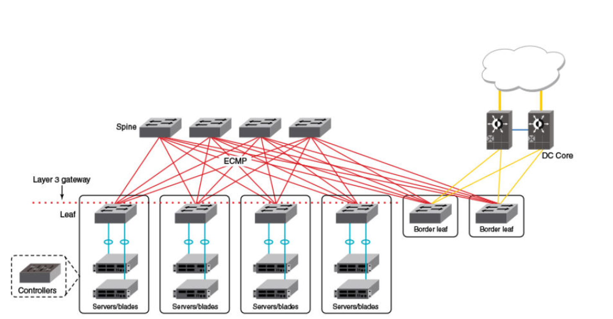

IP Fabric Solution
==================

About
-----

|bwc| is a network automation platform that automates the entire network life 
cycle and integrates with cross-domain workflows to improve business agility. Based on the 
StackStorm Open Source Project, Workflow Composer provides DevOps-inspired network automation
using open source technologies to integrate with cross-domain systems for end-to-end workflow automation.

|bwc| enables organizations to:

* Automate the entire network lifecycle including: provisioning, validation, troubleshooting and remediation
* Eliminate cross-function workflow delays through event-driven cross-domain automation
* Embrace automation at your own pace with turnkey workflows and nearly 2000 pre-built points of integration; 
  extend and customize to meet unique requirements with an architecture that is open at all layers
* Access broad community of like-minded peers to share ideas, collaborate, and support
* Leverage well-known tools and methods to ensure streamlined cross-domain integration

The |ipf| is an add-on package for |bwc| that provides services and pre-built automations for managing
Brocade IP Fabrics. It can provision and validate Brocade IP Fabrics and BGP-EVPN with minimal effort. It can 
easily be customized as required. 

Through the |ipf| CLI, network engineers are able to perform the following tasks:

* Specify IP Fabric configuration parameters for automated provisioning
* Show device and IP Fabric state or configuration
* Manage IP Fabric device inventory
* Add, delete, or show specific IP Fabric topology information

Brocade IP Fabric overview
--------------------------

An IP Fabric is a collection of discrete Layer 3 elements (such as switches and routers)
arranged in a leaf-spine network. These elements exchange Layer 3 reachability information (by
means of BGP and/or OSPF) to provide a flexible and scalable framework. An IP Fabric can use 
Layer 3/Layer 2 information (such as MAC, IP routes distributed by BGP—including eBGP and iBGP
as well as OSPF) to exchange Layer 3 routing information.

      **3-Stage Folded Clos Topology**

For more information about Brocade IP Fabrics, see the `Brocade Network OS IP Fabric Configuration
Guide <http://www.brocade.com/content/html/en/configuration-guide/nos-701-ipfabrics/index.html>`_

What's Next?
-------------------------------
* Install and run Brocade Workflow Composer and IP Fabric solution - follow the :doc:`install/index` guide.
