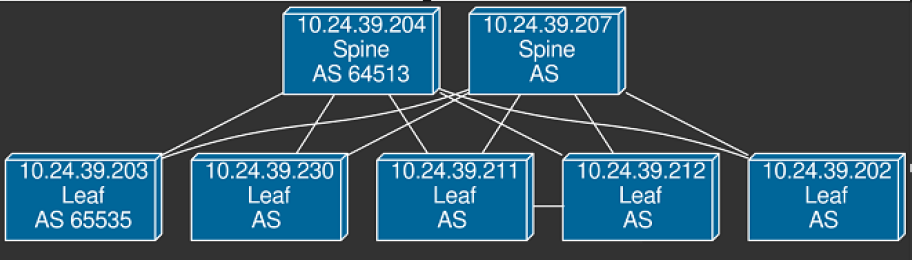
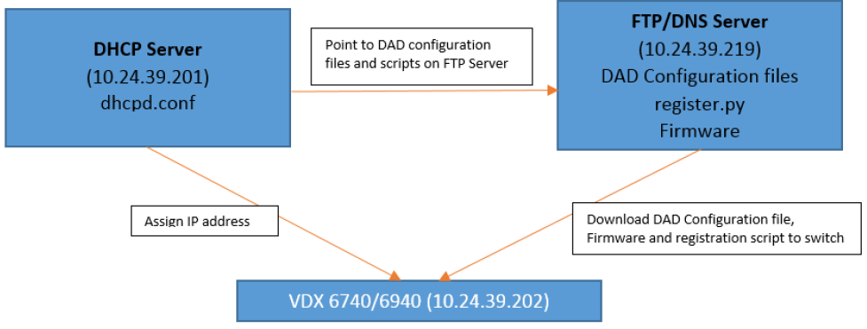

Brocade Workflow Composer ZTP use cases
=======================================

Zero Touch Provisioning (ZTP) is used to register a switch to the |bwc| using |ipf| and
run the BGP workflow automatically.

Use Case 1: Simple IP Fabric
----------------------------

In this case an IP Fabric consists of only Spines and Leaves. All spines and leaves get
one VCS and one Rbridge ID respectively.

.. figure:: ../_static/images/ztp_usecase_1.jpg
    :align: center

    **Simple IP Fabric Topology**

The configuration in the *Simple IP Fabric Topology* above includes the following VDX
switches, VCS IDs and Rbridge IDs:

- **Spines:** 10.24.39.204 and 10.24.39.207
    + **VCS ID:** 10
    + **Rbridge ID:** 10

- **Leaves:** 10.24.39.202, 10.24.39.203, 10.24.39.211, 10.24.39.212, and 10.24.39.230
    + **VCS ID:** 20
    + **Rbridge ID:** 20

Use Case 2: IP Fabric With two-node VCS Cluster as a Leaf
---------------------------------------------------------

Apart from spines and leaves this topology consists of two VDX switches forming a
two-node VCS cluster in LC mode.

.. note::
    For two VDX switches to be in a VCS cluster in LC mode, they must have the same VCS
    IDs, but different Rbridge-IDs. In the following figure note the link between
    10.24.39.211 and 10.24.39.212.

      **IP Fabric Topology With Two-Node VCS Cluster**

The configuration in the *IP Fabric Topology With Two-Node VCS Cluster* above includes
the following VDX switches, VCS IDs and Rbridge IDs:

- **Spines:** 10.24.39.204 and 10.24.39.207
    + **VCS ID:** 10
    + **Rbridge ID:** 10

- **Leafs:** 10.24.39.202, 10.24.39.203, and 10.24.39.230
    + **VCS ID:** 20
    + **RBRIDGE-ID:** 20

And the following configuration exists in the two-node VCS cluster:

-  **Leaf:** 10.24.39.211
    + **VCS ID:** 20
    + **Rbridge ID:** 21

- **Leaf:** 10.24.39.212:
    + **VCS ID:** 20
    + **Rbridge ID:** 22

.. note::
    The VCS ID for the two-node VCS cluster is same.

ZTP Process and Setup
=====================

A typical ZTP setup that can be used for both use cases is shown in the following diagram:

        **ZTP Topology with states**

This setup consists of a DHCP server, FTP/DNS server in the same network as the VDX
switches.

.. todo::
    Add Reference to the ZTP doc

DHCP server (dhcpd.conf)
------------------------
Every group in the DHCP server configuration file `dhcpd.conf` has the following components:

   - ``option bootfile-name <config file>;``
        This is the DAD configuration file that will be used during switch bootup. For
        example: ``/config/bwcZtpConfigForLeaf.cfg``

   - ``option tftp-server-name <FTP server IP>;``
        This is the FTP Server that contains the DAD configuration file, registration
        script, and firmware directories.

   - ``option routers <gateway IP>;``
        Gateway IP address for the network

   - ``host <hostname>`` # (For each switch):

       - ``option dhcp-client-identifier="BROCADE##<Model_Name>##<Switch_Serial_Number>";``
            This is the way to identify a switch. For Example:
            ``BROCADE##VDX6740##CPL2552J07A``

       - ``hardware ethernet <xx:xx:xx:xx:xx:xx>;``
            This is the Ethernet/MAC address of the switch.

       - ``fixed-address <Management IP of switch>;`` 
            This is the Management IP address the DHCP server must assign to that switch.

The following example shows the DHCP server configuration information. In the subnet
section, the range is 10.24.39.240 to 10.24.39.250 is used. The IP range should exclusively
be used for dynamic addresses. It should not include any static addresses.

.. code-block:: shell

   ddns-update-style none;
   ddns-ttl 600;
   ignore client-updates;
   ddns-domainname "mambaDNSDAD.com.";
   ddns-rev-domainname "in-addr.arpa.";

   option domain-name "mambaDNSDAD.com";
   option domain-search "mambaDNSDAD.com";
   
   option domain-name-servers 10.24.39.219;
   
   default-lease-time 600;
   max-lease-time 7200;
   authoritative;
   log-facility local7;
   
   subnet 10.24.39.192 netmask 255.255.255.192 {
       #range 10.24.39.240 10.24.39.250;
       option subnet-mask 255.255.255.192;
       option broadcast-address 10.24.39.255;

       zone 39.24.10.in-addr.arpa.{
           primary 10.24.39.219;
       }
   
       zone mambaDNSDAD.com.{
           primary 10.24.39.219;
       }
   }

   # Group for Leaves
   group{
       option bootfile-name "/config/bwcZtpConfigForLeaf.cfg";
       option tftp-server-name "10.24.39.219";
       option routers 10.24.39.193;
   
       host vdx210 {
           option dhcp-client-identifier="BROCADE##VDX6740##CPL2516J00M";
           hardware ethernet 00:27:F8:6F:C8:D0;
           fixed-address 10.24.39.230;
       }

       host vdx202 {
           option dhcp-client-identifier="BROCADE##VDX6740##CPL2552J07A";
           hardware ethernet 00:27:F8:D1:6D:47;
           fixed-address 10.24.39.202;
       }
   
       host vdx203 {
           option dhcp-client-identifier="BROCADE##VDX6740##CPL2503K00Z";
           hardware ethernet 00:27:F8:DB:6B:0D;
           fixed-address 10.24.39.203;
       }
   }

   # Group for 2 Node VCS Cluster
   group{
       option bootfile-name "/config/bwcZtpConfigForVcsCluster.cfg";
       option tftp-server-name "10.24.39.219";
       option routers 10.24.39.193;
   
       host vdx211{
           option dhcp-client-identifier="BROCADE##VDX6740##CGS0301J001";
           hardware ethernet 00:05:33:65:09:D9;
           fixed-address 10.24.39.211;
       }

       host vdx212{
           option dhcp-client-identifier="BROCADE##VDX6740##CGS0346H00Y";
           hardware ethernet 00:05:33:E5:D7:58;
           fixed-address 10.24.39.212;
       }
   }

   # Group for Spines
   group{
       option bootfile-name "/config/bwcZtpConfigForSpine.cfg";
       option tftp-server-name "10.24.39.219";
       option routers 10.24.39.193;
   
       host vdx204 {
           option dhcp-client-identifier="BROCADE##VDX8770-4##CDU2521J006";
           hardware ethernet 00:27:F8:88:81:09;
           fixed-address 10.24.39.204;
       }

       host vdx207 {
           option dhcp-client-identifier="BROCADE##VDX8770##CDU2521J005";
           hardware ethernet 00:27:F8:82:64:30;
           fixed-address 10.24.39.207;
       }

       host vdx236 {
           option dhcp-client-identifier="BROCADE##VDX6940##CWZ3837L003";
           hardware ethernet 50:EB:1A:AF:7D:4D;
           fixed-address 10.24.39.236;
       }
   }

DAD configuration files
-----------------------

DAD configuration files are downloaded to the switch as part of the ZTP process. Supported
use cases require three DAD Configuration files, one each for leaves, spines and a two-node
VCS cluster. The following parameters are used for the DAD configuration files:

.. todo::
   Might be better to do this as a table?

- Common_begin, common_end:
  The parameters and configurations in this section are applied to all the switches using
  this DAD configuration file.

- ZTP: When ZTP=1, the switch runs the ZTP process; when ZTP=0, the switch runs the DAD
  process. When ZTP=1, only configurations in the common section are applied, The
  individual host sections are ignored.

- vcsmode, vcsid: Assigns the switch the mentioned VCS ID and mode.

- rbridgeid: Assigns the switch the particular RBridge ID.

- principlerbridgeid: Assigns the principle switch the RBridge ID in case of VCS clusters.

- scriptcfgflg: When 0 loads the startup configuration file only; when 1, loads and runs
  the script; when 2, loads and runs both of them.

- script: The path of the script file (registration script) on the FTP server.

- morefiles: The path for some additional script files.

- startup: The path to start up the configuration file.

- fwdir: The path to the firmware directory from where firmware files can be downloaded
  and installed.

- vcstimeout: Timeout time for VCS to form a cluster.

- dadtimeout: Time out time for the DAD process, if not specified, the default value is 3
  days.
- host: Sections for the host in case of a DAD process. For example, it is used in case of
  a two-node VCS cluster. This section is considered only when ZTP=0.

- host_mac: The switch MAC address.

- host_sn: The switch serial number.

- defaultconfig: Applies the default configuration. If it is a yes script, globalconfig is ignored.

- globalcfg: The path to the global configuration.

Sample DAD configuration file for a spine
~~~~~~~~~~~~~~~~~~~~~~~~~~~~~~~~~~~~~~~~~

The following is a sample DAD configuration file for a spine:

.. code-block:: shell

    version=3
    date=09/01/2015
    supported_nos=7.0.0
    common_begin
    ztp=1
    vcsmode=LC
    vcsid=10
    rbridgeid=10
    scriptcfgflag=1 #0-config file only, 1-script only, 2 both
    script=/scripts/register.py
    #startup=
    #morefiles=/scripts/list/
    #fwdir=/firmware/nos6.0.1/SWBD1011/
    # 30 minute
    vcstimeout=30
    # 3 days = 4320 min
    dadtimeout=50
    common_end

Sample DAD configuration file for a leaf
~~~~~~~~~~~~~~~~~~~~~~~~~~~~~~~~~~~~~~~~

The following is a sample DAD configuration file for a leaf:

.. code-block:: shell

    version=3
    date=09/01/2015
    supported_nos=7.0.0
    common_begin
    ztp=1
    vcsmode=LC
    vcsid=20
    rbridgeid=20
    scriptcfgflag=1 #0-config file only, 1-script only, 2 both
    script=/scripts/register.py
    #startup=
    #morefiles=/scripts/list/
    #fwdir=/firmware/nos6.0.1/SWBD1011/
    # 30 minute
    vcstimeout=30
    # 3 days = 4320 min
    dadtimeout=50
    common_end

Sample DAD configuration file for a two-node VCS cluster
~~~~~~~~~~~~~~~~~~~~~~~~~~~~~~~~~~~~~~~~~~~~~~~~~~~~~~~~

The following is a sample DAD configuration file for a two-node VCS cluster:

.. code:: shell

    version=3
    date=09/01/2015
    supported_nos=7.0.0
    common_begin
    ztp=0
    vcsmode=LC
    vcsid=20
    principlerbridgeid=21
    scriptcfgflag=1 #0-config file only, 1-script only, 2 both
    script=/scripts/register.py
    #startup=
    #morefiles=
    #fwdir=
    # 30 minute
    vcstimeout=90
    # 3 days = 4320 min
    dadtimeout=120
    common_end
    #host(caster 211)
    host_mac=00:05:33:65:09:D9
    host_mac=00:05:33:65:09:D8
    host_sn=CGS0301J001
    rbridgeid=21
    defaultconfig=no
    #Empty for now
    startup=
    globalcfg=
    host_end
    #host(caster 212)
    host_mac=00:05:33:E5:D7:58
    host_mac=00:05:33:E5:D7:57
    host_sn=CGS0346H00Y
    rbridgeid=22
    defaultconfig=no
    #Empty for now
    startup=
    globalcfg=
    host_end

Registration script
-------------------

The registration script registers the switch to the |bwc| and then using |ipf| runs a BGP
workflow on the switch by sending another HTTP request to the Brocade Workflow Composer Server.
The registration script, once downloaded on the switch, is run from the following location
on the switch:

``/var/config/vcs/scripts``

The script also generates a registration log at the same location. It indicates if the
registration script ran successfully. Make changes to the following variables in the
`registration.py` script in the main method:

.. code:: python

    remote_server = 'dcip.bwc.local:8888' ## Ip address or DNS name of the server with port #
    token = 'Z3FJeENYb1BobURrUk9hWEZwd204U3BKRzJsN0g0eXU=' ## token
    username = 'devel' ## username
    fabric_name = 'default' ## name of the fabric to which the switch should register to.

The following example shows the register.py file. (This file is available in the |ipf| source code at
<location>)

.. todo::
    register.py script changes
    and source code location in above line
    .. code-block:: python

Running ZTP and DAD
-------------------

Use the following guidelines when running ZTP and DAD:

- ZTP/DAD must have a DHCP server.
- On the first boot, ZTP or DAD runs.
- When the switch is already on and you want to run ZTP, use the ``write erase``
  command on the switch.
- When the switch is already on and you want to run DAD process, use the ``dhcp autodeployment
  enable`` command on the switch.

.. note::

    When running ZTP or DAD, if you use dhcp autodeployment enable, if anything is wrong
    in the setup or configurations, |ipf| will display the incorrect configuration. While
    running ZTP, Brocade recommends that you run this command and see if everything is set
    up correctly. If everything is correct, you will be prompted to reboot the switch. At
    this point you can enter “no” if you want to run ZTP and then use the write erase command.
    This step is helpful because the ZTP and DAD process itself is lengthy.

Verification of ZTP and DAD
---------------------------

To verify whether the ZTP and DAD process ran correctly, complete the following steps:

1. Run the ``show vcs command`` on the switch to make sure the switch has a VCS ID,
   an RBridge ID, VCS mode, and a management IP address assigned.

2. Run the ``show dad status`` command to make sure the DAD and ZTP process ran. Look for the
   "DAD 1314" code. If there any other error codes, refer to the `Using DHCP Automatic
   Deployment` section in the `Brocade Network OS Administration Guide` for more information about
   additional DAD codes.

3. Check the |bwc| server to see if the switch is registered and the BGP workflow completed
   successfully on it.

4. To verify that the registration script executed successfully, check `registration.log`
   file on the switch at the ``/var/config/vcs/scripts/`` location. You can use a ``cat``
   command on the log file from the "root" account.
